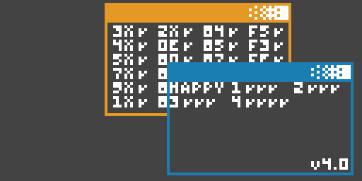

# Chipception

CHIP-8 interpreters have been written in *every* programming language... except in
CHIP-8 itself.

Until now! 😄

# Development log

## Wait but why..?

I've been thinking about writing a CHIP-8 interpreter in CHIP-8 for almost two
years or so. Yeah, you read that right. An interpreter for the CHIP-8 bytecode,
itself programmed in CHIP-8. It's just such an insane idea that I can't help
but find myself attracted to it.

To be clear: there is absolutely no benefit to just having a CHIP-8 interpreter
written in CHIP-8. It would only allow you to run the exact same programs, but
slower and probably with more unexpected bugs. Also, it's quite the engineering
challenge to make it actually work. So it's a significant investment of time
that brings absolutely no tangible benefit. Sounds like my kind of project! 🎉

However, thinking about this a bit longer, there are a few cool things we could
do with such an interpreter. One is adaptation: it could act as a mediator
between programs and interpreters that don't play nice otherwise, without
modifying the original program **or** the interpreter running it. A CHIP-8
program that relies on a version of CHIP-8 (or one with specific quirks) that
you don't support in your interpreter could be wrapped in a CHIP-8 CHIP-8
interpreter, and run just fine in your interpreter.

Another kinda cool thing that I wanted to experiment with is multithreaded
CHIP-8. A CHIP-8 interpreter written in CHIP-8 could theoretically run multiple
CHIP-8 programs in parallel on a single host interpreter. This has no real
benefit, but it would be something cool to play with. It also touches on
another itch that I have had for a while and that kinda needed scratching:
writing an operating system for CHIP-8.

Last Octojam sysl made [a program that was a mock-up of a CHIP-8 PDA operating
system](https://sysl.itch.io/bim-logo-animation), that they called BIM. It makes
sense for them to model a "CHIP-8 OS" on a PDA-type device, since you can't
really "download" or "install" new programs into a running CHIP-8 interpreter.
PDAs used to come with a fixed set of "applications" like a calendar or a
calculator that were just baked into the ROM of the device, each just running
directly on the hardware and taking over full control of the CPU. However, when
I dream about a "CHIP-8 OS", I think about something that resembles the early
Unixes, that can run programs in "user mode", with a "kernel" that can do
"scheduling" or kill misbehaving programs and maybe some way for programs to
communicate with each other.

So maybe, just maybe, starting with a CHIP-8 interpreter in CHIP-8 is the first
step in the journey towards a true CHIP-8 operating system. One that runs CHIP-8
programs, that you can switch between or run in parallel. Maybe a few custom
opcodes could allow for the program to communicate with the host OS or other
programs?

So I drew this image of a four colour XO-CHIP program running a "desktop" GUI
with two CHIP-8 programs running in parallel to inspire myself:

Alright, enough rationalizing an irrational project and having crazy pipe dreams
about its potential, let's get to coding 😉

## Getting started

I came up with the project name "Chipception", short for "CHIP-8 Inception",
and got to work.

### So what are we up against?

Writing a CHIP-8 interpreter isn't too hard. This will be the fourth time I
write one. But writing one in a language that **is also** the target language
brings both a couple of challenges and a couple of shortcuts.

The good news is that many opcodes can just be passed on to the host interpreter
as-is. To AND two registers, we just ask the host to AND two registers. Save the
result, save the flag register, and we're done (if we're just ignoring quirks).

The bad news is that we will actually need all the registers that CHIP-8
provides us with for running the interpreter. So every opcode will need to
operate on virtual registers in memory, adding quite a lot of overhead.

Next to that, it's super hard to predict how a CHIP-8 program will use RAM. So
we can't gracefully "share" the 4K of memory space, without a crazy amount of
overhead. Our interpreter would have to keep track of which parts of RAM are
being written to and do some kind of memory management. But even then: many of
the worth while ROMs for CHIP-8 are 80+ percent of the available storage. In
those cases there's just not enough space to add the interpreter at all.

Also; there's this little thing called self-modifying code, where a CHIP-8
program modifies itself to achieve some goal. For some programs, this trick
_may_ depend on the fact that a reset of the program loads in a fresh new
version of the ROM. So this means that to do it right and be a proper
interpreter, we have to make a copy of the ROM before we start execution.

Because of these memory requirements and the CPU overhead I very soon had to
accept the fact that this was going to be an XO-CHIP project. And that it will
only interpret systems that require less memory than XO-CHIP, like CHIP-8 and
SUPER-CHIP.

### Getting things going!

The first version of this program came together in a little over one evening:
initialize virtual registers, fetch an opcode, branch correctly on the opcode,
proxy all the CHIP-8 instructions to operate on the virtual registers. I also
added in a few quirks for good measure and my CHIP-8 CHIP-8 interpreter was
running and passing most of the available tests.

The [quirks test](https://github.com/Timendus/chip8-test-suite#quirks-test) was
the hardest to get right, because I was targeting CHIP-8 and SUPERCHIP, but my
host system was using XO-CHIP quirks. So my Chipception interpreter needed to
implement versions of the required quirks, using the XO-CHIP quirks. Especially
getting the `sprite` opcode to clip properly on the edges of the screen was a
bit of a pain. It also required quite a few cycles per frame.

So after doing quite a lot of work on this project, I arrived at this rather
unsatisfying point. I could successfully run a single CHIP-8 or SUPERCHIP
program in an XO-CHIP interpreter. Just a little bit slower. And precisely no
one could actually see the difference with **not** having done all of this extra
work.

## One is none

So to get some return on investment, I decided that I would immediately take
this project in the direction of running multiple interpreters in parallel. If
you can run multiple programs next to each other, surely that's obviously
something new. Something different.

Because all my code was already operating on virtual registers in memory, it
was actually not that hard to get it to run multiple virtual CPUs in parallel.
Making use of the fact that SUPER-CHIP `hires` is twice the CHIP-8 `lores`
resolution, I could pretty quickly get Chipception to render this:

Which is clearly much more cool! A single unmodified CHIP-8 interpreter that's
running four distinct ROMs at once? Now we're talking! 😄

However, these programs are chosen quite carefully. If any program tries to
clear the screen or shift it, everything totally breaks. Also, when you press a
button, all programs register the same keypress. Which is probably not very
useful behaviour.

Virtualising the display turned out to be a lot more work than doing the CPU. I
had to -- once again -- write a custom double buffered rendering system with a
custom sprite drawing routine in CHIP-8 that could draw 8xN and 16x16 sprites
as well as get all the quirks right. Then I had to implement the `clear` opcode
and all the scrolling opcodes to operate on those buffers. Just so that each
interpreter could have its own isolated display behaviour.

And then I needed to composit those discrete display buffers together to form
the full display output. Because I wanted to be able to move virtual windows
over each other, those windows also needed to occlude each other. The normal
`sprite` behaviour does not support that kind of rendering. So the composite
step also renders everything to **yet another** virtual display buffer, that is
then finally drawn to the screen.

After all of that, I decided it was time for some lighter work: I wanted to
render some colourful borders around the virtual windows, to make it look a
little bit more like my inspirational drawing. How hard can it really be to
render a few lines and squares to a virtual display buffer in an unusual memory
lay-out?

Yeah. So that took me way longer than I care to admit. I put the project down
for a couple of days, just because I was too annoyed I couldn't get the damn
routine to draw a bloody horizontal line 😂 But after taking a few breaths and
a couple of days off, I managed to produce some primitive drawing routines and
now all of a sudden 8ception could do this:

This is still just a single CHIP-8 ROM running in Octo, with a custom colour
scheme. This is starting to go somewhere!

## Managing windows

Now that I had all these cute little windows into CHIP-8 programs, I felt it was
time to make them interactive. I started by introducing the concept of a
"focussed window". The windows were given an ordering so they could behave like
a stack, like people are used to on their regular computers. The window "on top"
is then considered to be "focussed". Inspired by my concept art, I made the
focussed foreground window blue and the other windows orange.

Now that there is one window that's clearly "active", we can do fun things with
that. The most important thing: the interpreter in the focussed window gets
keypresses, and the others do not. So by switching the focussed window, you also
change which program you're interacting with as a user.

Speaking of switching windows, I implemented a crude "Alt-Tab" functionality to
cycle through the windows on the screen. The CHIP-8 key `A` (mapped to `Z` on a
Qwerty keyboard), being in the bottom left corner of the keypad, became a sort
of "function key" for interacting with Chipception, instead of the currently
focussed ROM.

These are the key combos I wrote to begin with:

| CHIP-8 keys | Qwerty keys | Function                               |
| ----------- | ----------- | -------------------------------------- |
| `A` - `1`   | `Z` - `1`   | Switch windows ("Alt-Tab")             |
| `A` - `4`   | `Z` - `Q`   | <ins>Q</ins>uit focussed interpreter   |
| `A` - `D`   | `Z` - `R`   | <ins>R</ins>eset focussed interpreter  |
| `A` - `5`   | `Z` - `W`   | Move focussed <ins>w</ins>indow around |

Moving windows around is done with either WASD or the cursor keys on a
computer keyboard, or `5`, `7`, `8` and `9` on a CHIP-8 keypad. Pressing our
function key `A` / `Z` again returns the system into normal mode.

Admittedly, the combinations make a lot more sense on a Qwerty keyboard than on
a CHIP-8 keypad. See underlined letters. But I wanted to use combinations that I
could actually remember 😅

So now I could switch between CHIP-8 windows, move them around and interact with
the CHIP-8 ROMs running in them 🎉

## Running out of space

Unfortunately, at this point I ran into my arch nemesis. Space constraints.

Last year I battled this foe with [Bad Apple!! in
XO-CHIP](https://github.com/Timendus/chip-8-bad-apple) and the year before with
[3D VIP'r Maze](https://github.com/Timendus/3d-vipr-maze) for the original
Cosmac VIP interpreter. For Bad Apple the challenge was fitting the whole music
video, both video frames and sound, into the total XO-CHIP memory size of 64KB.
With 3D VIP'r Maze the challenge was fitting the game and its graphics and game
data in the lousy 3.2KB of memory that the VIP interpreter allows for ROMs to
be.

This year, truth be told, I really wasn't expecting to run into any significant
memory issues. This is an XO-CHIP project. I wasn't doing anything stupid like
trying to compress a music video down to an insanely small size. I only have a
few ROMs to load, I need some free memory to manage and I have the code for
Chipception itself. If it doesn't fit, I just include fewer ROMs. What could go
wrong?

Well, after just a couple of days of actual development, I hit the dreaded 3.5KB
executable code limit. It turns out that after four years of this stuff I got
pretty fast at writing lots of CHIP-8 assembly code...

### What's the 3.5KB executable limit?

CHIP-8 ROMs can be as big as you like. You can append bytes to infinity. The
problem isn't making the ROM bigger, it's being able to make use of your bytes.

CHIP-8 has something known as the index register. The index register is used to
point at memory and then perform operations with the memory being pointed at.
The index register is set using a 16-bit opcode that looks like this in
hexadecimal:

* `0xAnnn`

The `nnn` here is a placeholder for the address we want the index register to
point at. And `nnn` is 12 bits wide. So CHIP-8 can only address 2 to the power
of 12 bytes, which is 4KB. Subtract from that the fact that CHIP-8 programs
start at memory address `512`, and we're left with a maximum adressable ROM size
of 3.5KB. Anything above that we simply can't point to to make use of it.

The same applies to the opcodes for jumping and calling subroutines, which look
like this respectively:

* `0x1nnn`
* `0x2nnn`

Here `nnn` is a placeholder for the address we want to jump to or call into. So
just like with setting the index register, we can't go anywhere that's outside
the 3.5KB boundary.

[XO-CHIP](https://github.com/JohnEarnest/Octo/blob/gh-pages/docs/XO-ChipSpecification.md)
adds a double sized opcode (`0xF000 0xnnnn`) that can set the index register to
a 16-bit value, allowing us to address 2 to the power of 16, which is 64KB.
Minus the same 512 bytes, but that's not as big of a deal at that scale. But
XO-CHIP does not give us 16-bit jumps or subroutine calls. Which creates the
interesting situation where we can have plenty of space left "in the ROM", but
we can only use that space for storing data. Not for storing code.

That's the 3.5KB executable limit.

The sharp observers among you are now probably screaming two things at your
screens:

1. Just move your data to higher addresses, so you can make maximum use of those
   3.5K for code!
2. If you can't jump above the 3.5K limit, you can still run code there. How
   about you just unroll some loops or something and make your code go on
   forever!

To the first, I say: I'm already doing just that. One of the main reasons that I
wrote my [Octopus
preprocessor](https://github.com/Timendus/chipcode/tree/main/octopus) is that I
wanted to have an easy way to mark part of my CHIP-8 program as data, and have
it automatically moved to the end of the ROM. That's working wonders. So yes, I
have actually writting 3.5KB of executing code.

To the second: that sounds great, but without jumping we basically lose any
meaningful flow control in CHIP-8. Because all the conditional opcodes only jump
over a single instruction, and in many cases you really need that single
instruction to be a jump (over a longer block of code). You could jump over
subroutine calls and store the subroutines below the 3.5KB limit, but in
practice that doesn't buy you much.

(Also, it's quite possible that some XO-CHIP interpreters don't support
returning from a subroutine to an address that's more than 12 bits either,
depending on how they implemented their stack.)

In all honesty, I'm not 100% convinced that CHIP-8 without jumps or subroutines
is even Turing-complete...

### So now what?

Time to optimize. Already.

I made a quick list of five areas in the code where I could start looking for
optimizations, and got to work.
