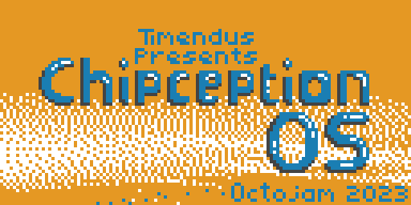
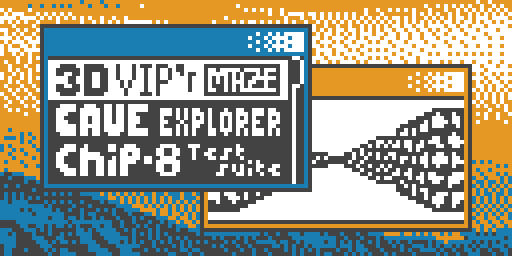
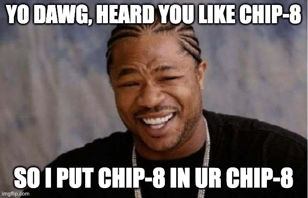
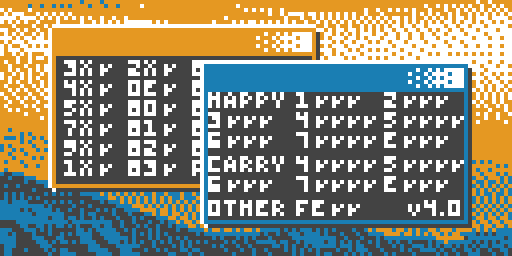
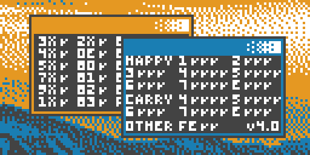

[](https://ko-fi.com/T6T0DOOWP)

# Chipception



A CHIP-8 and SUPER-CHIP interpreter written in XO-CHIP. My submission to
[Octojam 10](https://itch.io/jam/octojam-10). Because CHIP-8 interpreters have
been written in *every* programming language and the platform also deserves one
written in CHIP-8 itself! 😄

* [This program on Itch.io](https://timendus.itch.io/chipception-os)
* [Run Chipception in your browser](https://timendus.github.io/chipception/)
* [Download the ROM](https://github.com/Timendus/chipception/raw/main/dist/chipception.ch8)

## How to use Chipception

Chipception will provide you with a menu (known as the launcher app) from which
you can select ROMs to run. You can run at most six ROMs in parallel. Note that
the launcher app itself counts as a ROM.

The launcher app will properly start ROMs in either CHIP-8 or SUPER-CHIP mode,
and with the correct quirks. You can not change those settings interactively.



These are the keys that control the launcher:

| CHIP-8 key | Qwerty key     | Function                               |
| ---------- | -------------- | -------------------------------------- |
| `5`        | `W` or ↑       | Go up one ROM in the launcher app      |
| `8`        | `S` or ↓       | Go down one ROM in the launcher app    |
| `6`        | `E` or `space` | Start selected ROM in the launcher app |

The CHIP-8 key `A` (or `Z` on a querty keyboard) acts as a global modifier key,
 like a `ctrl` or `alt` key on a computer. It can be used from anywhere to send
these commands to Chipception:

| CHIP-8 keys | Qwerty keys | Function                               |
| ----------- | ----------- | -------------------------------------- |
| `A` + `1`   | `Z` + `1`   | Cycle through windows ("Alt-Tab")      |
| `A` + `B`   | `Z` + `C`   | <ins>C</ins>lose focussed interpreter  |
| `A` + `D`   | `Z` + `R`   | <ins>R</ins>eset focussed interpreter  |
| `A` + `5`   | `Z` + `W`   | Move focussed <ins>w</ins>indow around |
| `A` + `E`   | `Z` + `F`   | <ins>F</ins>ullscreen the window       |
| `A` + `8`   | `Z` + `S`   | <ins>S</ins>tart the launcher app      |

When you are moving a window, these are the relevant keys:

| CHIP-8 key | Qwerty key | Function                    |
| ---------- | -----------| --------------------------- |
| `5`        | `W` or ↑   | Move window up              |
| `8`        | `S` or ↓   | Move window down            |
| `7`        | `A` or ←   | Move window left            |
| `9`        | `D` or →   | Move window right           |
| `A`        | `Z`        | Return to normal execution  |

## The concept



Chipception is a lot of things. It's primarily just a dumb idea and a bit of a
joke to write a CHIP-8 interpreter in CHIP-8. But it's also an experiment to
start figuring out what an "operating system" for CHIP-8 could look like.

Can we do multitasking? Can we have inter-process communication? How do we do
window management? How do you control the "OS" with only a 16-key keypad? What
kind of paradigms from PCs, mobile phones or PDAs make sense for CHIP-8?

I'm not sure if I'm done with this experiment yet, but right now it's just a
cool talking piece for Octojam 10. And, with it running at 200.000+ instructions
per frame, yet another ROM to stress-test people's interpreters 😄

## See also

If you like this, you may also enjoy my other CHIP-8 projects:

  * [3D Viper Maze](https://github.com/Timendus/3d-viper-maze) (XO-CHIP, Octojam
    7) and [3D VIP'r Maze](https://github.com/Timendus/3d-vipr-maze) (original
    CHIP-8)
  * [Alien Inv8sion](https://github.com/Timendus/alien-inv8sion) (XO-CHIP with
    "secret 16-colour mode", Octojam 8)
  * [Bad Apple!!](https://github.com/Timendus/chip-8-bad-apple) (XO-CHIP,
    Octojam 9)

If you are a CHIP-8 emulator / interpreter developer, you may be interested in
these projects:

  * [CHIP-8 test suite](https://github.com/Timendus/chip8-test-suite) -
    A test suite to find all kinds of issues in your interpreter
  * [CHIP-8 Binary Format](https://github.com/Timendus/chip8-binary-format) -
    An effort to standardise on a file format for CHIP-8 and friends
  * [CHIP-8 database](https://github.com/chip-8/chip-8-database) - A repository
    with metadata for CHIP-8 ROMs

# Development log

## Wait but why..?

I've been thinking about writing a CHIP-8 interpreter in CHIP-8 for almost two
years or so. It's just such an insane idea that I can't help but find myself
attracted to it.

To be clear: there is absolutely no benefit to just having a CHIP-8 interpreter
written in CHIP-8. It would only allow you to run the exact same programs, but
slower and probably with more unexpected bugs. Also, it's quite the engineering
challenge to make it actually work. So it's a significant investment of time
that brings absolutely no tangible benefit. Sounds like my kind of project! 🎉

However, thinking about this a bit longer, there are a few cool things we could
do with such an interpreter. One is adaptation: it could act as a mediator
between programs and interpreters that don't play nice otherwise, without
modifying the original program **or** the interpreter running it. A CHIP-8
program that relies on a version of CHIP-8 (or one with specific quirks) that
you don't support in your interpreter could be wrapped in a CHIP-8 CHIP-8
interpreter, and run just fine in your interpreter.

Another kinda cool thing that I wanted to experiment with is multithreaded
CHIP-8. A CHIP-8 interpreter written in CHIP-8 could theoretically run multiple
CHIP-8 programs in parallel on a single host interpreter. This has no real
benefit, but it would be something cool to play with. It also touches on
another itch that I have had for a while and that kinda needed scratching:
writing an operating system for CHIP-8.

Last Octojam sysl made [a program that was a mock-up of a CHIP-8 PDA operating
system](https://sysl.itch.io/bim-logo-animation), that they called BIM. It makes
sense for them to model a "CHIP-8 OS" on a PDA-type device, since you can't
really "download" or "install" new programs into a running CHIP-8 interpreter.
PDAs used to come with a fixed set of "applications" like a calendar or a
calculator that were just baked into the ROM of the device, each just running
directly on the hardware and taking over full control of the CPU.

However, when I dream about a "CHIP-8 OS", I think about something that
resembles the early Unixes, that can run programs in "user mode", with a
"kernel" that can do "scheduling" or kill misbehaving programs and maybe some
way for programs to communicate with each other.

So maybe, just maybe, starting with a CHIP-8 interpreter in CHIP-8 is the first
step on the journey towards a true CHIP-8 operating system. One that runs CHIP-8
programs, that you can switch between or run in parallel. Maybe a few custom
opcodes could allow for the program to communicate with the host OS or other
programs?

So I drew this image of a four colour XO-CHIP program running a "desktop" GUI
with two CHIP-8 programs running in parallel to inspire myself:


Alright, enough rationalizing an irrational project and having crazy pipe dreams
about its potential, let's get to coding 😉

## Getting started

I came up with the project name "Chipception", short for "CHIP-8 Inception",
and got to work.

### So what are we up against?

Writing a CHIP-8 interpreter isn't too hard. This will be the fourth time I
write one. But writing one in a language that **is also** the target language
brings both a couple of challenges and a couple of shortcuts.

The good news is that many opcodes can just be passed on to the host interpreter
as-is. To AND two registers, we just ask the host to AND two registers. Save the
result, save the flag register, and we're done (if we're just ignoring quirks).

The bad news is that we will actually need all the registers that CHIP-8
provides us with for running the interpreter. So every opcode will need to
operate on virtual registers in memory, adding quite a lot of overhead.

Next to that, it's super hard to predict how a CHIP-8 program will use RAM. So
we can't gracefully "share" the 4K of memory space, without a crazy amount of
overhead. Our interpreter would have to keep track of which parts of RAM are
being written to and do some kind of memory management. But even then: many of
the worth while ROMs for CHIP-8 are 80+ percent of the available storage. In
those cases there's just not enough space to add the interpreter at all.

Also; there's this little thing called self-modifying code, where a CHIP-8
program modifies itself to achieve some goal. For some programs, this trick
_may_ depend on the fact that a reset of the program loads in a fresh new
version of the ROM. So this means that to do it right and be a proper
interpreter, we have to make a copy of the ROM before we start execution.

Because of these memory requirements and the CPU overhead I very soon had to
accept the fact that this was going to be an XO-CHIP project. And that it will
only interpret systems that require less memory than XO-CHIP, like CHIP-8 and
SUPER-CHIP.

### Getting things going!

The first version of this program came together in a little over one evening:
initialize virtual registers, fetch an opcode, branch correctly on the opcode,
proxy all the CHIP-8 instructions to operate on the virtual registers. I also
added in a few quirks for good measure and my CHIP-8 CHIP-8 interpreter was
running and passing most of the available tests.

The [quirks test](https://github.com/Timendus/chip8-test-suite#quirks-test) was
the hardest to get right, because I was targeting CHIP-8 and SUPERCHIP, but my
host system was using XO-CHIP quirks. So my Chipception interpreter needed to
implement versions of the required quirks, using the XO-CHIP quirks. Especially
getting the `sprite` opcode to clip properly on the edges of the screen was a
bit of a pain. It also required quite a few cycles per frame.


So after doing quite a lot of work on this project, I arrived at this rather
unsatisfying point. I could successfully run a single CHIP-8 or SUPERCHIP
program in an XO-CHIP interpreter. Just a little bit slower. And precisely no
one could actually see the difference with **not** having done all of this extra
work.

## One is none

So to get some return on investment, I decided that I would immediately take
this project in the direction of running multiple interpreters in parallel. If
you can run multiple programs next to each other, surely that's obviously
something new. Something different.

Because all my code was already operating on virtual registers in memory, it
was actually not that hard to get it to run multiple virtual CPUs in parallel.
Making use of the fact that SUPER-CHIP `hires` is twice the CHIP-8 `lores`
resolution, I could pretty quickly get Chipception to render this:


Which is clearly much more cool! A single unmodified CHIP-8 interpreter that's
running four distinct ROMs at once? Now we're talking! 😄

However, these programs are chosen quite carefully. If any program tries to
clear the screen or shift it, everything totally breaks. Also, when you press a
button, all programs register the same keypress. Which is probably not very
useful behaviour.

Virtualising the display turned out to be a lot more work than doing the CPU. I
had to -- once again -- write a custom double buffered rendering system with a
custom sprite drawing routine in CHIP-8 that could draw 8xN and 16x16 sprites as
well as get all the quirks right. Then I had to implement the other opcodes to
operate on those buffers. Just so that each interpreter could have its own
isolated display behaviour<sup>1</sup>.

And then I needed to composit those discrete display buffers together to form
the full display output. Because I wanted to be able to move virtual windows
over each other, those windows also needed to occlude each other. The normal
`sprite` behaviour does not support that kind of rendering. So the composite
step also renders everything to **yet another** virtual display buffer, that is
then finally drawn to the screen.

After all of that, I decided it was time for some lighter work: I wanted to
render some colourful borders around the virtual windows, to make it look a
little bit more like my inspirational drawing. How hard can it really be to
render a few lines and squares to a virtual display buffer in an unusual memory
lay-out?

Yeah. So that took me way longer than I care to admit. I put the project down
for a couple of days, just because I was too annoyed I couldn't get the damn
routine to draw a bloody horizontal line 😂 But after taking a few breaths and
a couple of days off, I managed to produce some primitive drawing routines and
now all of a sudden Chipception could do this:


This is still just a single CHIP-8 ROM running in Octo, with a custom colour
scheme. This is starting to go somewhere!

_Note 1: I never properly finished the buffer scrolling opcodes as the ROMs I
chose to run in this interpreter didn't use them. In the end I removed the
scrolling behaviour entirely to save executable space. So in that sense it's not
a "full" SUPER-CHIP interpreter, unfortunately. It can be done, but only at the
expense of leaving out some other features._

## Managing windows

Now that I had all these cute little windows into CHIP-8 programs, I felt it was
time to make them interactive. I started by introducing the concept of a
"focussed window". The windows were given an ordering so they could behave like
a stack, like people are used to on their regular computers. The window "on top"
is then considered to be "focussed". Inspired by my concept art, I made the
focussed foreground window blue and the other windows orange.

Now that there is one window that's clearly "active", we can do fun things with
that. The most important thing: the interpreter in the focussed window gets
keypresses, and the others do not. So by switching the focussed window, you also
change which program you're interacting with as a user.

Speaking of switching windows, I implemented a crude "Alt-Tab" functionality to
cycle through the windows on the screen. The CHIP-8 key `A` (mapped to `Z` on a
Qwerty keyboard), being in the bottom left corner of the keypad, became a sort
of "function key" for interacting with Chipception, instead of the currently
focussed ROM.

These are the key combos I wrote to begin with:

| CHIP-8 keys | Qwerty keys | Function                               |
| ----------- | ----------- | -------------------------------------- |
| `A` - `1`   | `Z` - `1`   | Cycle through windows ("Alt-Tab")      |
| `A` - `4`   | `Z` - `Q`   | <ins>Q</ins>uit focussed interpreter   |
| `A` - `D`   | `Z` - `R`   | <ins>R</ins>eset focussed interpreter  |
| `A` - `5`   | `Z` - `W`   | Move focussed <ins>w</ins>indow around |

I later changed `Z` - `Q` to `Z` - `C` because I kept accidentally quiting ROMs
when I tried to cycle through them 🙈

Moving windows around is done with either WASD or the cursor keys on a
computer keyboard, or `5`, `7`, `8` and `9` on a CHIP-8 keypad. Pressing our
function key `A` / `Z` again returns the system into normal mode.

Admittedly, the combinations make a lot more sense on a Qwerty keyboard than on
a CHIP-8 keypad. See underlined letters. But I wanted to use combinations that I
could actually remember 😅

So now I could switch between CHIP-8 windows, move them around and interact with
the CHIP-8 ROMs running in them 🎉


## Running out of space

Unfortunately, at this point I ran into my arch nemesis. Space constraints.

Last year I battled this foe with [Bad Apple!! in
XO-CHIP](https://github.com/Timendus/chip-8-bad-apple) and the year before with
[3D VIP'r Maze](https://github.com/Timendus/3d-vipr-maze) for the original
Cosmac VIP interpreter. For Bad Apple the challenge was fitting the whole music
video, both video frames and sound, into the total XO-CHIP memory size of 64KB.
With 3D VIP'r Maze the challenge was fitting the game and its graphics and game
data in the lousy 3.2KB of memory that the VIP interpreter allows for ROMs to
be.

This year, truth be told, I really wasn't expecting to run into any significant
memory issues. This is an XO-CHIP project. I wasn't doing anything stupid like
trying to compress a music video down to an insanely small size. I only have a
few ROMs to load, I need some free memory to manage and I have the code for
Chipception itself. If it doesn't fit, I just include fewer ROMs. What could go
wrong?

Well, after just a couple of days of actual development, I hit the dreaded 3.5KB
executable code limit. It turns out that after four years of this stuff I got
pretty fast at writing lots of CHIP-8 assembly code...

### What's the 3.5KB executable limit?

CHIP-8 ROMs can be as big as you like. You can append bytes to infinity. The
problem isn't making the ROM bigger, it's being able to make use of your bytes.

CHIP-8 has something known as the index register. The index register is used to
point at memory and then perform operations with the memory being pointed at.
The index register is set using a 16-bit opcode that looks like this in
hexadecimal:

* `0xAnnn`

The `nnn` here is a placeholder for the address we want the index register to
point at. And `nnn` is 12 bits wide. So CHIP-8 can only address 2 to the power
of 12 bytes, which is 4KB. Subtract from that the fact that CHIP-8 programs
start at memory address `512`, and we're left with a maximum adressable ROM size
of 3.5KB. Anything above that we simply can't point to to make use of it.

The same applies to the opcodes for jumping and calling subroutines, which look
like this respectively:

* `0x1nnn`
* `0x2nnn`

Here `nnn` is a placeholder for the address we want to jump to or call into. So
just like with setting the index register, we can't go anywhere that's outside
the 3.5KB boundary.

[XO-CHIP](https://github.com/JohnEarnest/Octo/blob/gh-pages/docs/XO-ChipSpecification.md)
adds a double sized opcode (`0xF000 0xnnnn`) that can set the index register to
a 16-bit value, allowing us to address 2 to the power of 16, which is 64KB.
Minus the same 512 bytes, but that's not as big of a deal at that scale. But
XO-CHIP does not give us 16-bit jumps or subroutine calls. Which creates the
interesting situation where we can have plenty of space left "in the ROM", but
we can only use that space for storing data. Not for storing code.

That's the 3.5KB executable limit.

The sharp observers among you are now probably screaming two things at your
screens:

1. Just move your data to higher addresses, so you can make maximum use of those
   3.5K for code!
2. If you can't jump above the 3.5K limit, you can still run code there. How
   about you just unroll some loops or something and make your code go on
   forever!

To the first, I say: I'm already doing just that. One of the main reasons that I
wrote my [Octopus
preprocessor](https://github.com/Timendus/chipcode/tree/main/octopus) is that I
wanted to have an easy way to mark part of my CHIP-8 program as data, and have
it automatically moved to the end of the ROM. That's working wonders. So yes, I
have actually written 3.5KB of executing code.

To the second: that sounds great, but without jumping we basically lose any
meaningful flow control in CHIP-8. Because all the conditional opcodes only jump
over a single instruction, and in many cases you really need that single
instruction to be a jump (over a longer block of code). You could jump over
subroutine calls and store the subroutines below the 3.5KB limit, but in
practice that doesn't buy you much.

In all honesty, I'm not 100% convinced that CHIP-8 without jumps or subroutines
is even Turing-complete...

Also, some XO-CHIP interpreters wrap the program counter around from `0xFFF` to
`0x000`, or don't support returning from a subroutine to an address that's more
than 12 bits. So realisticly, we just have to keep our code below the 3.5KB
limit.

### So now what?

Time to optimize. Already. For every feature I add from now on, I will also have
to cut some dead weight.

## Looks matter

One thing I remembered was that I already added code to show a background image,
but I couldn't get my background image data in memory in the right format. So
until now I was clearing the screen, for which I had also added a separate
routine. If I fixed my background data format, I could remove the screen
clearing code.

So I manually created the right background image layers in the GIMP to import
into my project with the [Chipcode image loader
plugin](https://github.com/Timendus/chipcode/tree/main/image-loader).


Next I had to add an 8 by 64 pixels mode to the image loader, which it turns out
Gulrak's excellent [Chiplet assembler](https://github.com/gulrak/chiplet)
already supported too. I then also wanted to fix some annoyances with the window
shadows, so that the windows stick out enough from the background. Just like in
my graphical mockup.

And voila! I added a feature while also throwing out a routine that I didn't
need anymore!



Compare that to the mock-up I made at the start of this project! I was quite
amazed that I had come this far already 😄

After some feedback from the #chip-8 channel on the EmuDev Discord I was not
entirely convinced that these window shadows are the best looking option. Here
are some alternatives I drew:




After messing with the different alternatives in the code a bit, I realised that
I could implement the last design with the smallest number of instructions.
Changing the design again saved around 50 bytes 🎉

## Launching programs

If the idea is for this thing to be a "CHIP-8 operating system", then we should
at the very least be able to launch programs. But I was almost out of executable
memory, so writing a start menu or another graphical program launcher was out of
the question.

Lucky for me, I was already considering having "Chipception programs" that could
achieve some Chipception specific things with custom opcodes. So I quite quickly
realised that I didn't really need a whole interface in my executable space, all
I **really** needed was an opcode for launching a new program. Then I could
write a ROM that would actually be the interactive interface for the user.

One of the hardest things to figure out was how the launcher ROM could know
which ROMs are available to Chipception. The solution turned out to be quite
simple, albeit not super clean.

When loading a ROM, Chipception just lazily copies data from the starting
address of the ROM all the way until the memory of the virtualized interpreter
is full. This way I didn't have to store the sizes of the ROM files. That means
that any data *after* the launcher ROM is also copied into the launcher's
memory, and is, almost accidentally, accessible to the ROM.

So I just made sure that the memory lay-out of the launcher ROM looks like this:

```python
: launcher
    :byte SUPERCHIP
    :include "../roms/launcher.ch8"


: rom-table
    # Number of ROMs, max is currently 32
    9

    :pointer rom-3d-vipr-maze
    :include "../roms/3d-vipr-maze.png" no-labels

    :pointer rom-cave-explorer
    :include "../roms/cave-explorer.png" no-labels

    :pointer rom-test-suite
    :include "../roms/chip8-test-suite.png" no-labels

    # ...
```

It's not pretty, but by having a table with information on the available ROMs
and their starting addresses loaded right after the launcher ROM, we can show
the user which ROMs Chipception has available with a nice graphic, and the
launcher ROM can start the selected program by invoking the new
Chipception-specific opcode.


Having this fancy new launcher meant that my old testing code, that just
launched several interpreters with fixed settings and ROMs, could be slimmed
down to a single subroutine. So we once again actually saved executable memory
space while adding a new feature!

## Not the first

Around this time I discovered that I wasn't actually the first to write a CHIP-8
interpreter in CHIP-8. Which makes perfect sense. If I feel attracted to the
stupidity of such an idea, surely there are other emulator devs who feel the
same. But I had done a Google search before starting the project, and nothing
showed up.

But when sharing some more screenshots of Chipception-in-progress on the EmuDev
Discord I was told that [Geotale wrote a CHIP-8 interpreter in
CHIP-8](https://johnearnest.github.io/Octo/index.html?key=26l2CvY6) in 2021. Mad
props to Geotale for daring to take up that project and beating me to it!

Lucky for me, their implementation doesn't do multi-tasking and window
management, nor implement SUPER-CHIP. So my project is still unique in those
regards, I hope 😉

## Finishing the project

The last stretch of this project was mostly fixing lingering bugs and adding
some polish, constantly fighting against the executable memory limit.

I have a ton of ideas left, but both running into the executable code limit and
running into the deadline for Octojam told me that I needed to finish this
project up for now.

These ideas were left on the cutting room floor:

  * Allow Chipception to read [CHIP-8 Binary
    Format](https://github.com/Timendus/chip8-binary-format) files
  * Support `hires` ROMs, scaled down in windows, with the option to go full
    screen on them
  * Add some proper memory management and register how much memory each ROM
    really needs, so we can run more ROMs in parallel
  * Have ROMs define their desired window size so not all windows are so similar
  * Write some more Chipception-specific ROMs that an OS needs, like a process
    manager, a calculator, Paint, maybe a "text editor" 😜
  * Supporting the XO-CHIP instruction set

All in all, I'm quite happy with how close I've come to a "CHIP-8 OS", in the
sense of what I described in the beginning of this dev log! 🎉

Thanks for reading all of this, and good luck with your own projects! 👋
